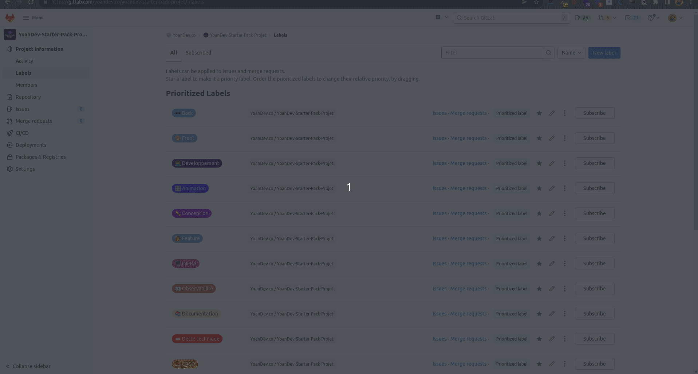
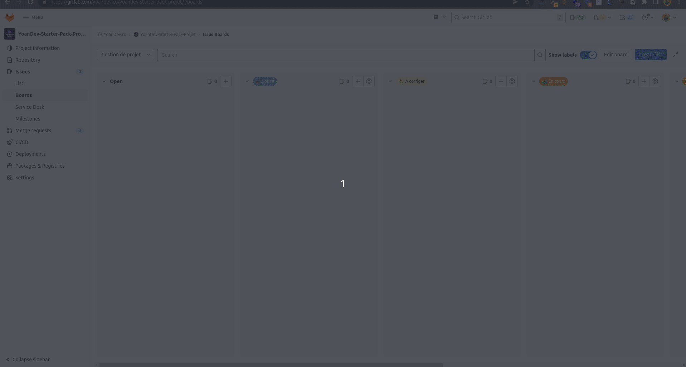
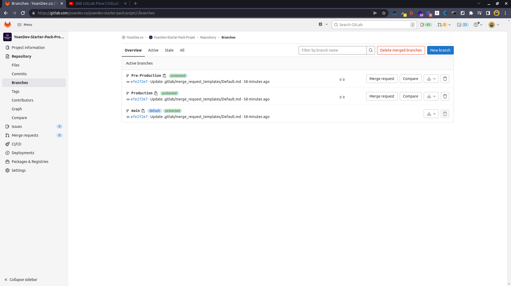
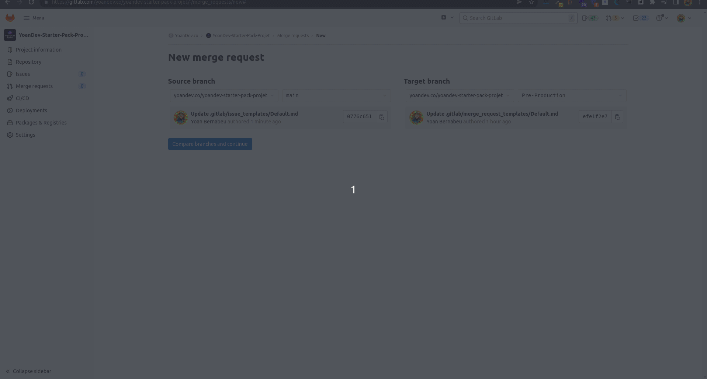

# YoanDev-Starter-Pack-Projet

Starter Pack pour organiser et gérer un projet avec GitLab 🦊

##  1.  Table des matières
<!-- vscode-markdown-toc -->
* 1. [ Table des matières](#Tabledesmatires)
* 2. [Pourquoi ce dépôt ?](#Pourquoicedpt)
* 3. [Que propose ce dépôt ?](#Queproposecedpt)
	* 3.1. [Les labels](#Leslabels)
	* 3.2. [Le Board](#LeBoard)
	* 3.3. [Les branches](#Lesbranches)
	* 3.4. [Modèles pour les issues et les merges requests](#Modlespourlesissuesetlesmergesrequests)
* 4. [Comment utiliser ce dépôt ?](#Commentutilisercedpt)
* 5. [Licence](#Licence)
* 6. [Auteur](#Auteur)

<!-- vscode-markdown-toc-config
	numbering=true
	autoSave=true
	/vscode-markdown-toc-config -->
<!-- /vscode-markdown-toc -->

##  2. Pourquoi ce dépôt ?

Ce dépot à pour objectif de fournir un outil de démarrage rapide pour organiser et gérer un nouveau projet avec GitLab.

Partant du constat que le démarrage d'un projet est un processus long et complexe, j'ai voulu fournir un outil simple et efficace pour lancer un projet avec GitLab et ses outils !

##  3. Que propose ce dépôt ?

Ce dépôt fournit un ensemble de modèles, de fichiers et de paramétrages pour vous faciliter le démarrage d'un projet avec GitLab, vous y retrouverez les éléments suivants :

-   Ce fichier README.md
-   Des modèles pour les issues et les merges requests
-   Une collection de labels
-   Un modèle de Board
-   3 Branches :
    -   Main
    -   Pré-Production
    -   Production

###  3.1. Les labels

Les labels sont des éléments qui sont associés à des issues et merges requests et qui permettent de les classer, le organiser et de les identifier simplement.

###  3.2. Le Board

Le Board est l'outil central de GitLab pour organiser et gérer votre projet.

Il va vous permettre de visualiser les différentes tâches que vous avez à accomplir, et de suivre leur progression.

La structure de ce board adopte l'approche [Scrumban](https://asana.com/fr/resources/scrumban).

###  3.3. Les branches

Les trois branches proposées dans ce template permettent de gérer de manière simple l'état du déploiement de votre projet.

Elles sont particulièrement utiles si vous leurs associez des pipelines GitLab CI pour automatiser le déploiement de votre projet en fonction des branches.

Ce modèle s'inspire librement de l'approche [GitLab Flow](https://www.youtube.com/watch?v=ZJuUz5jWb44).

###  3.4. Modèles pour les issues et les merges requests

Ce template propose des modèles pour les issues et les merges requests afin de simplifier et standardiser leur utilisation par les équipes du projet.

##  4. Comment utiliser ce dépôt ?

> Vous pouvez utiliser ce dépôt comme **source d'inspiration** pour votre animer votre projet avec GitLab simplement en copiant et adaptant les idées que vous trouverez pertinentes dans votre contexte.

> **Vous pouvez également télécharger l'export du dépôt pour l'importer avec tous les éléments dèja présents (labels, issues, merges requests, board, branches, ...)**
> 1. [Télécharger l'export du dépôt](.ressources/export.tar.gz)
> 2. [Importer l'export dans GitLab](https://docs.gitlab.com/ee/user/project/settings/import_export.html#import-a-project-and-its-data)
> 3. Amusez-vous bien !

##  5. Licence

Ce dépôt est sous licence [MIT](LICENSE)

##  6. Auteur

[YoanDev](https://yoandev.co)